# 📅 가계북

  </img>

## ⏳ 프로젝트 진행과정 ##
> SSAFY 12기 1학기 관통 프로젝트 
> 개발기간: 2024.11.18 ~ 2024.11.27

## 🔥 가계북 개발 배경
> 현재 시중의 가계부 서비스들은 복잡한 입력 과정과 번거로운 사용자 경험으로 인해 지속적인 사용이 어렵다는 문제점이 있습니다. 특히 소비 내역을 일일이 수기로 입력해야 하는 불편함과, 입력된 데이터를 효과적으로 활용하지 못하는 한계가 존재합니다.
> 이러한 문제점을 해결하기 위해 저희 팀은 다음과 같은 특징을 가진 새로운 가계부 서비스를 개발하였습니다

> 1. 스마트한 데이터 입력
> - OCR 기술을 활용한 영수증 자동 인식 시스템
> - 수기/전자/종이영수증 모두 지원
> - 자동 카테고리 분류 및 데이터 추출
> 2. 직관적인 소비 분석
> - 캘린더 기반의 시각적 소비 내역 관리
> - 카테고리별 지출 분석 차트
> - 월별/주간 소비 패턴 분석
> 3. 맞춤형 카드 추천
> - 사용자의 소비 패턴 분석 기반 추천
> - OpenAI의 text-embedding-3-large 모델 활용
> - 코사인 유사도 기반의 정확한 카드 매칭
> 4. 편리한 예산 관리
> - 월별 예산 설정 및 관리
> - 실시간 지출 현황 모니터링

## 🔧 개발 환경 및 기술 스택 ##

### Frontend ###
 
 

### Backend ###

### 버전/이슈관리 ###

## 협업 ##

## ERD ##
  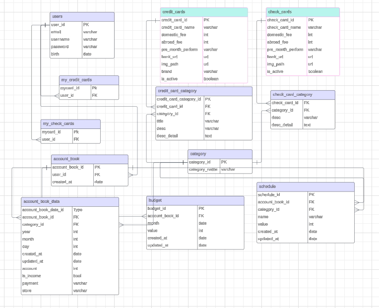</img>

## REST API URL

### auth ###

  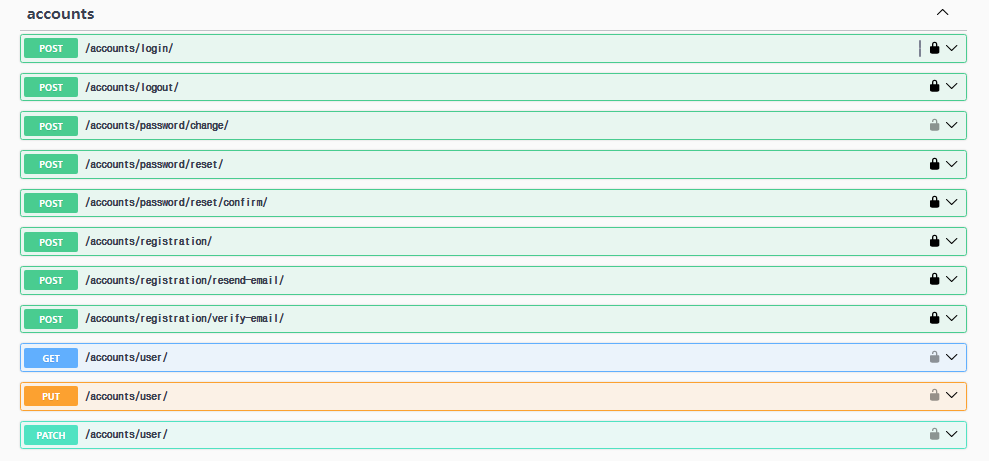</img>

### 가계부 ###

  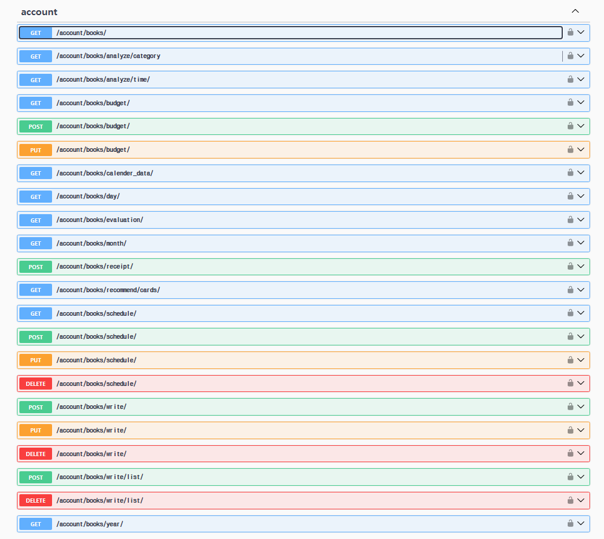</img>

### 카드 ###

  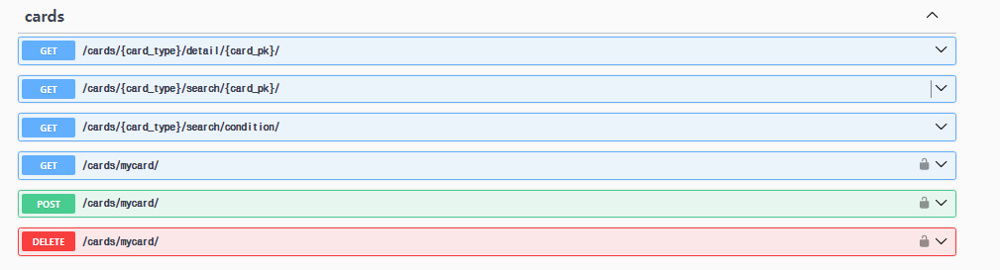</img>

## 가계북 주요 기능 ##

### 🔔메인페이지 ###

  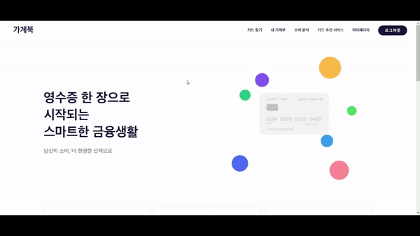</img>

 
 

### 📌카드 조회 ###

#### 카드 조회 ####

  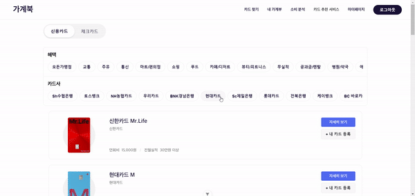</img>

> 카테고리별 필터링과 검색 기능을 통해 원하는 카드를 쉽게 찾을 수 있습니다. 각 카드의 주요 혜택과 기본 정보를 카드 리스트에서 바로 확인할 수 있습니다.

#### 카드 상세 페이지 ####

  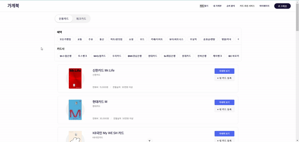</img>

> 선택한 카드의 상세 혜택, 연회비, 전월실적 등 자세한 정보를 제공합니다. 카드사 바로가기를 통해 즉시 카드 신청도 가능합니다.

 
 

### 📅 캘린더 ###

#### 달력 ####

  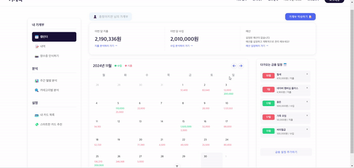</img>

> 월별 수입/지출 내역을 캘린더 형태로 시각화하여 제공합니다. 날짜별 거래 내역을 한눈에 파악할 수 있습니다.

#### 내역 ####

  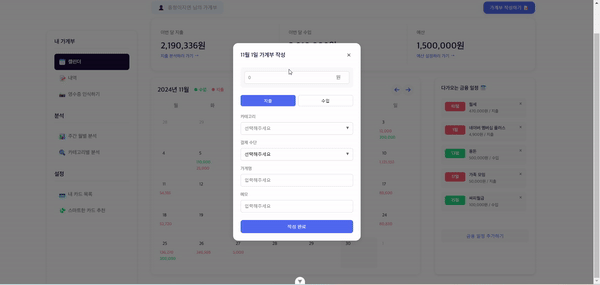</img>

> 거래 내역을 쉽게 추가하고 관리할 수 있습니다. 수입/지출, 카테고리, 금액, 메모 등 상세 정보를 기록할 수 있습니다.

#### 예산 ####

  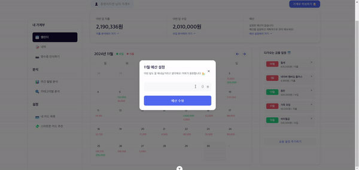</img>

> 월별 예산을 설정하고 관리할 수 있습니다. 설정된 예산 대비 실제 지출 현황을 추적할 수 있습니다.

#### 금융일정 ####

  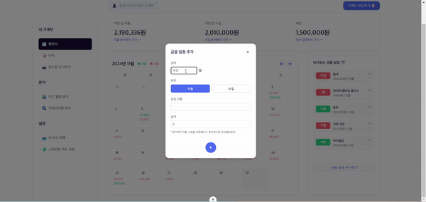</img>

> 정기적인 수입/지출 일정을 등록하고 관리할 수 있습니다. 월세, 공과금 등의 고정 지출을 자동으로 기록할 수 있습니다.

 
 

### 📝 내역 ###

#### 내역 조회 ####

  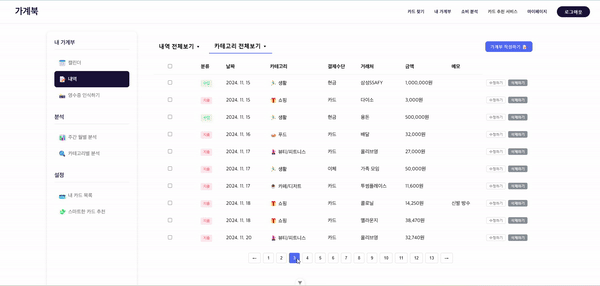</img>

> 전체 거래 내역을 리스트 형태로 확인할 수 있습니다. 카테고리별 필터링과 검색 기능을 제공합니다.

#### 내역 수정삭제 ####

  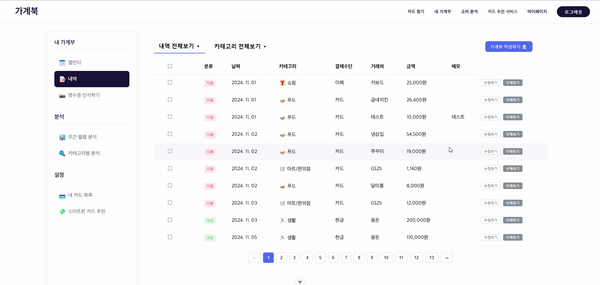</img>

> 등록된 거래 내역을 간편하게 수정하거나 삭제할 수 있습니다. 잘못 입력된 정보를 즉시 수정할 수 있습니다.

 
 

### 📸 영수증 인식 ###

  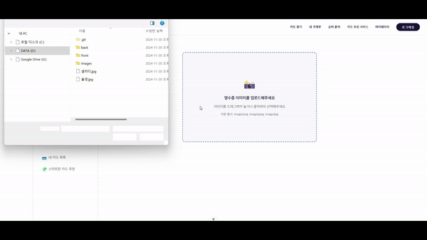</img>

> OCR 기술을 활용하여 영수증을 자동으로 인식하고 거래 내역을 등록할 수 있습니다. 수기, 전자, 종이영수증 모두 지원합니다.

 
 

### 📊 주간 월별 분석 ###

  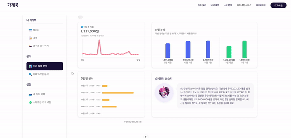</img>

> 기간별 소비 패턴을 다양한 차트로 분석하여 제공합니다. 지출 추이와 카테고리별 분석을 통해 효율적인 자금 관리가 가능합니다.

 
 

### 🔍 카테고리별 분석 ###

  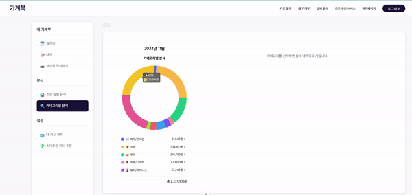</img>

> 카테고리별 지출 현황을 도넛 차트로 시각화하여 제공합니다. 각 카테고리별 상세 내역도 함께 확인할 수 있습니다.

 
 

### 💳 내카드 목록 ###

  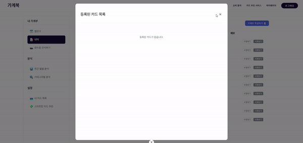</img>

> 사용중인 카드를 등록하고 관리할 수 있습니다. 등록된 카드의 혜택을 쉽게 확인하고 활용할 수 있습니다.

 
 

### 💸 스마트한 카드 추천 ###

  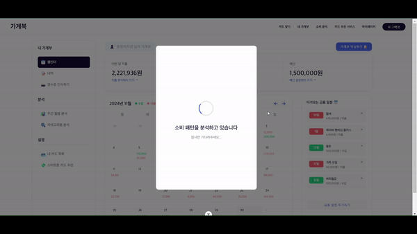</img>

> 사용자의 소비 패턴을 분석하여 최적의 카드를 추천해줍니다. 추천된 카드의 상세 정보를 바로 확인하고 신청할 수 있습니다.
> 카드 추천은 OpenAI 임베잉 모델을 활용해 벡터화한 데이터와의 사용내역 데이터 사이의 유사도를 측정하는 방식으로 구현하였습니다.

 
 

## 💡 개선하고 싶은 점
> 1. 알림 기능 추가
> - 예산 초과 시 실시간 알림
> - 정기적인 금융 일정 알림 (공과금, 카드값 등)
> - 카테고리별 지출 한도 알림
> - 새로운 카드 혜택 및 프로모션 알림
> 2. 데이터 분석 강화
> - 연간 소비 패턴 분석 추가
> - 유사 연령대/직군 대비 소비 패턴 비교
> - AI 기반 맞춤형 절약 팁 제공
> - 카테고리별 상세 분석 리포트
> 3. 사용자 경험 개선
> - 모바일 반응형 디자인 최적화
> - 엑셀/PDF 형식의 데이터 내보내기 기능
> 4. 소셜 기능
> - 내 소비 자랑하기 커뮤니티
> - 사용자 간 카드 리뷰 공유
> - 가계부 챌린지 기능
> 5. 카드 추천 기능
> - 정확한 사용 금액에 따른 가중치 계산 
> - 카드별 혜택종류의 혜택 세기에 따른 가중치를 추가해 좀 더 정확한 카드 추천 기능 구현

 
 

## 📝 소감 및 느낀 점
### 이지연 (FE)
> 이번 프로젝트를 진행하며 기능 구현 시 발생하는 문제들을 함께 해결하는 과정에서 커뮤니케이션 능력이 향상되었을 뿐 아니라 Git을 통한 버전 관리와 협업 프로세스를 체득했습니다.
>   특히 백엔드를 담당한 동현이와 함께 작업하면서, API 연동 과정에서 데이터 타입이 불일치 하여 포멧팅 하는 과정, 여러 호출이 동시에 일어났을 로딩 상태 관리하는 등 더 나은 방향을 찾아가는 과정이 매우 값진 경험이었습니다. 페어의 든든한 서포트와 끊임없는 소통 덕분에 성공적으로 구현할 수 있었습니다. 이 자리를 빌어 프로젝트 기간 내내 열정적으로 함께해준 동현이에게 무한한 감사를 전합니다!!
> 넌 최고야 !!!!
>   조금 아쉬운 점이 있다면, 코드의 재사용성과 모듈화가 부족했던 부분이 있었고, 테스트 코드 작성과 에러 처리가 미흡했습니다.
>   하지만, 프로젝트를 통해 실제 서비스 개발에 필요한 다양한 경험을 쌓을 수 있었고, 사용자의 관점에서 생각하고 문제를 해결하는 능력이 크게 향상되었다고 느낍니다.

### 송동현 (BE)
> 프로젝트를 기획하고 기능을 구현하면서 많은 문제들이 발생하였습니다. 저희는 이슈가 발생할 때마다 상대방의 의견에 귀기울이고 어떤게 최선인지 같이 고민하면서 프로젝트를 완성했습니다. 
> 이번 프로젝트를 통해 GIT이용한 협업방법에 대해 배울 수 있었고 프론트에 데이터 전달할 때 어떻게 전달하면 좋은지 알게 되었습니다. 
> 이번 프로젝트에서 아쉬었던 점은 view함수를 작성하면서 함수마다 같은 과정을 수행하는 코드를 반복사용한 것을 모듈화하면 더 좋았을거 같은 것과 쿼리 수 좀 더 줄일 수 있지 않았을까 라는 아쉬움이 남았습니다. 
> 이번 프로젝트를 통해 사용자와 팀 동료처럼 다른 사람들의 관점에서 문제를 생각하고 커뮤니케이션하는 방법에 대해서 많이 배운 시간이었던거 같습니다.

 
 

## :family: 팀원 소개 ##
<table align="center">
  <tr>
    <td>
<b>이지연
</td>
    <td>
<b>송동현
</td>
  </tr>
  <tr>
    <td></td>
    <td></td>
  </tr>
  <tr>
    <td>
Frontend
</td>
    <td>
Backend
</td>
  </tr>
</table>
